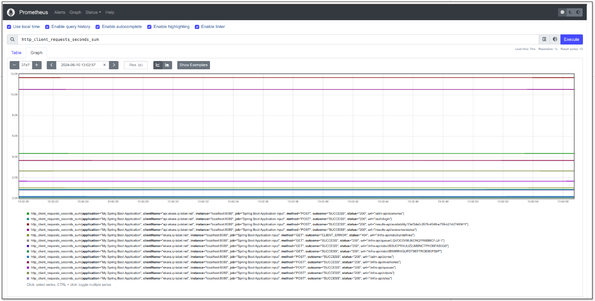
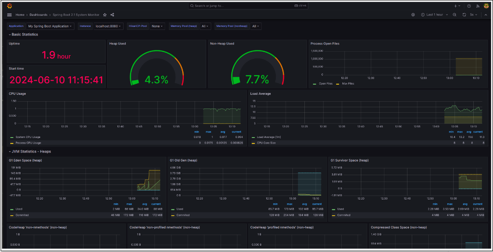
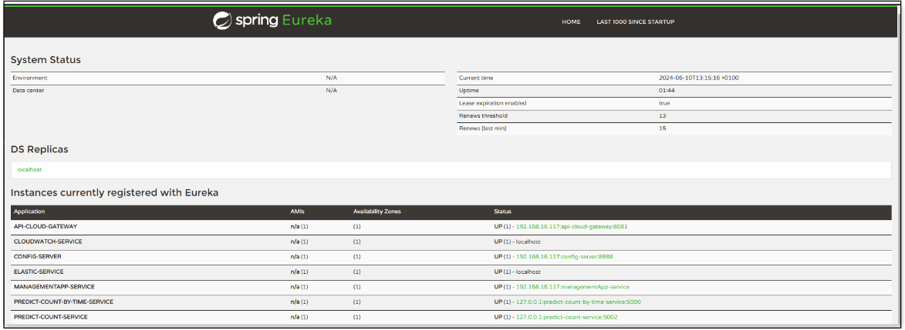
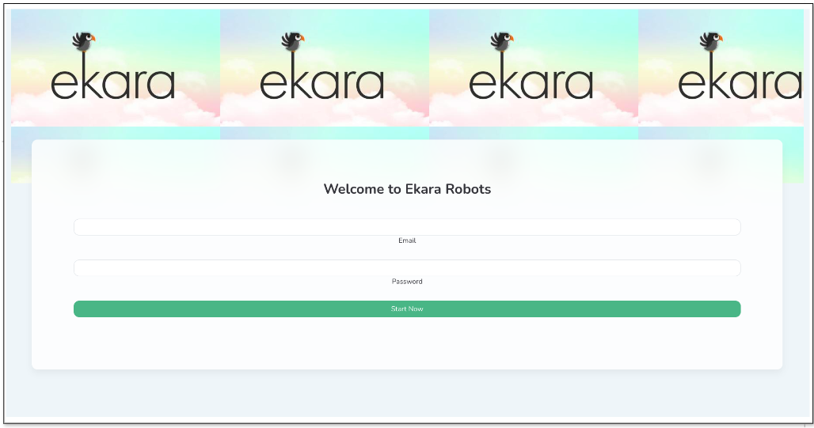

# Ekara Robot Management Microservice

## Overview

This repository is part of a larger system composed of multiple microservices. This specific microservice is responsible for managing Ekara robots. It consumes external APIs to gather data, primarily using `RestTemplate`. The microservice is built using **Spring Boot** and **Spring Cloud** and includes integrations with **Eureka** for service discovery, **Prometheus** and **Grafana** for monitoring, and **Docker** and **Docker Compose** for containerization.

## Features

### 1. Ekara Robot Management
- **API Consumption**: Utilizes `RestTemplate` to consume external APIs as the source of data for managing Ekara robots.
- **Robot Management**: Provides endpoints for managing the lifecycle and operations of Ekara robots.

### 2. Microservice Architecture
- **Spring Boot and Spring Cloud**: Leverages Spring Boot for building the application and Spring Cloud for service integration and configuration.
- **Service Discovery**: Integrates with **Eureka** for service registration and discovery.

### 3. Monitoring and Observability
- **Prometheus**: Used for monitoring the application metrics.
- **Grafana**: Provides a visualization layer for the metrics collected by Prometheus.

### 4. Containerization
- **Docker**: The application is containerized using Docker for ease of deployment.
- **Docker Compose**: Utilizes Docker Compose to define and manage multi-container Docker applications.

## Technical Requirements

- **Technologies**: Spring Boot, Spring Cloud, Eureka, Prometheus, Grafana, Docker, Docker Compose

## Setup and Usage

1. **Clone the Repository**:
   ```bash
   git clone <repository-url>
   cd <repository-directory>
   ```

2. **Set Up**:
   - Ensure you have Docker and Docker Compose installed on your system.

3. **Configuration**:
   - Configure the necessary environment variables and configuration files for Eureka, Prometheus, and Grafana integrations.


4. **Accessing the Application**:
   - The application will be accessible via the configured local server address.

## Monitoring

- **Prometheus**: Access the Prometheus dashboard to view application metrics.
- **Grafana**: Use the Grafana dashboard for a visual representation of the metrics collected by Prometheus.

## API Endpoints

- **Robot Management**: Endpoints for managing Ekara robots.
- **External API Consumption**: Endpoints that consume and process data from external APIs using `RestTemplate`.
- 
### Dashboards

<div style="display: flex; justify-content: space-around;">
  
  
  
  
  

</div>


